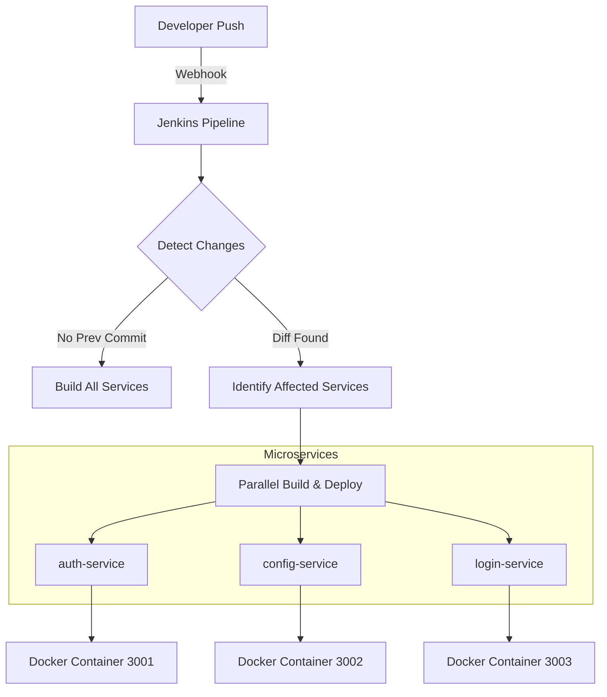

# 🚀 Branch-Aware CI/CD Pipeline for Monorepo Microservices

A smart, branch-aware CI/CD pipeline built using **Jenkins** that detects changes in a monorepo and selectively builds and deploys only the affected microservices.

## 🎯 Goal

To optimize CI/CD workflows in a monorepo architecture by:
- 🚀 **Eliminating unnecessary builds**
- ⏱️ **Reducing execution time**
- 📈 **Improving deployment efficiency**
- 🧠 **Introducing intelligent change detection**

---

## ⚙️ Tech Stack

- **Jenkins** – CI/CD orchestration
- **Docker** – Containerization
- **Git & GitHub** – Version control
- **Node.js (Express)** – Microservices
- **Linux (Ubuntu Agent)** – Execution environment

---

## 🔥 Key Features

- ✅ **Selective microservice builds** based on code changes.
- ⚡ **Parallel execution** of independent service builds.
- 🔍 **Intelligent change detection** using Git commit diffs.
- 🐳 **Fully automated** container build and deployment.
- 🏗️ **Optimized for monorepo architecture**.
- 🔄 **First-build fallback logic** (automatically builds everything if no previous commit is found).

---

## 🏗️ Architecture

### 📊 System Flow



### Components:
- **GitHub Repository (Monorepo)**: Contains `auth-service`, `config-service`, and `login-service`.
- **Jenkins Pipeline**: The brain that orchestrates detection, builds, and runs.
- **Docker Engine**: Handles image creation and container management.

---

## 🔄 Workflow / How It Works

1. **Trigger**: Pipeline starts on a GitHub push event.
2. **Commit Comparison**: Fetches the `GIT_PREVIOUS_SUCCESSFUL_COMMIT`.
3. **Diff Analysis**: Runs `git diff --name-only <previous_commit> HEAD`.
4. **Change Mapping**: Matches changed file paths with service directories.
5. **Selective Execution**: Sets boolean flags (`authChanged`, etc.) to trigger only the required stages.
6. **Deployment**: Stops existing containers and runs new versions of updated services.

---

## 🛠️ Setup Instructions

### ✅ Prerequisites
- Jenkins installed and running.
- Docker installed on the Jenkins agent.
- Git configured on the agent.
- A GitHub repository with the microservices.
- An Ubuntu-based Jenkins agent labeled `ubuntu-agent`.

### 📦 Installation
```bash
git clone https://github.com/your-repo/advanced-microservice-pipeline.git
cd advanced-microservice-pipeline
```

### ⚙️ Configuration
1. **Create Jenkins Pipeline**: Create a "Pipeline" or "Multibranch Pipeline" job.
2. **Connect SCM**: Link your GitHub repository.
3. **Configure Webhook**: Set up a GitHub webhook to trigger on `push` events.
4. **Agent Setup**: Ensure your Jenkins agent has the label `ubuntu-agent` and permissions to run Docker.

### ▶️ Run Project
- Simply push a change to any service folder (e.g., `auth-service/index.js`).
- Monitor the Jenkins console output to see the selective build in action.

---

## 🔗 Integrations

- **GitHub Webhooks** → Automatic pipeline triggers.
- **Docker** → Image management and container runtime.
- **Jenkins** → End-to-end orchestration.

---

## 📦 CI/CD Pipeline

| Stage | Description |
| :--- | :--- |
| **Checkout Code** | Clones the latest code from the repository. |
| **Detect Changes** | Compares current HEAD with the last successful commit to identify changed services. |
| **Build Services** | Runs parallel Docker builds for ONLY the changed services. |
| **Run Containers** | Restarts containers for updated services with the new images. |

---

## 🌿 Branch Strategy

- **`main`** → Production-ready code. Continuous deployment to "production" containers.
- **Feature branches** → Development work. Can trigger builds for verification without affecting production.
- **Pipeline Logic** → Specifically handles branch-based triggers and state resets.

---

## ⚠️ Previous Pipeline (Issues & Analysis)

### ❌ Old Pipeline (Env-based approach)
The initial approach used environment variables to track changes, which led to several reliability issues.

```groovy
environment {
    AUTH_CHANGED   = "false"
    CONFIG_CHANGED = "false"
    LOGIN_CHANGED  = "false"
}
```

#### 🚩 Problems:
1. **Environment Variable Mutation**: Jenkins environment variables are not reliably mutable inside script blocks for conditional logic in subsequent stages.
2. **`when` Condition Failure**: String comparison against `env` variables often failed or was inconsistent.
3. **Hidden Behavior**: Declarative pipelines serialize state, and `env` behaves differently from local Groovy variables.
4. **Result**: Changes would be detected, but flags remained "false", causing stages to skip incorrectly.


*Figure: The old pipeline detecting changes but failing to set flags correctly.*


*Figure: Stages being skipped despite changes in the codebase.*

---

## ✅ New Pipeline (Working Solution)

### 🛠️ Key Fixes:
1. **Local Groovy Variables**: Replaced `env` with standard Groovy variables (`def authChanged = false`) for reliable state management.
2. **Global Scoping**: Defined variables outside the `pipeline` block to ensure they are accessible across all stages.
3. **Boolean Expressions**: Used direct boolean usage in `when` clauses (`expression { authChanged }`) to eliminate string comparison errors.
4. **Reset Logic**: Explicitly reset flags at the start of the `Detect Changes` stage to prevent stale values.


*Figure: New pipeline correctly identifying and building only the changed services.*


*Figure: Verification of flags being set correctly and respected by the pipeline.*

---

## 🚀 Future Improvements

- [ ] **Docker Tagging**: Implement version-based tagging (e.g., `auth-service:1.0.2`).
- [ ] **Remote Registry**: Push builds to DockerHub, AWS ECR, or GitHub Packages.
- [ ] **Kubernetes Migration**: Replace standalone Docker containers with K8s deployments using Helm.
- [ ] **Dynamic Discovery**: Automatically detect new service directories without hardcoding names.
- [ ] **Pre-build Testing**: Add automated unit and integration tests before the build stage.

---

## 🧠 Learnings

- **Scope Matters**: Jenkins `env` variables are great for static values but poor for dynamic state flags in complex pipelines.
- **Git is King**: Leveraging `git diff` directly is more consistent than relying on Jenkins' internal change tracking in monorepos.
- **Optimization**: Significant time and resource savings are achieved by avoiding redundant builds in microservice architectures.

---

## 🏁 Conclusion

This project demonstrates a production-grade DevOps solution for optimizing CI/CD workflows. By moving from a naive environment-based approach to a robust, Groovy-driven detection mechanism, the pipeline ensures that only what changes gets built—leading to faster cycle times and more efficient resource utilization.
